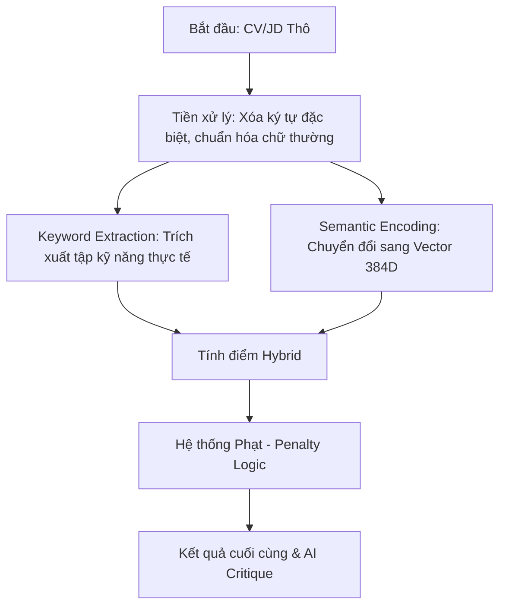

# 📘 CHUYÊN KHẢO NGHIÊN CỨU KHOA HỌC: HỆ THỐNG MATCHAI PRO
**Đề tài**: Tối ưu hóa quy trình sàng lọc nhân sự thông qua mô hình ngôn ngữ đa ngôn ngữ và hệ thống chấm điểm lai: Tiếp cận dựa trên Sentence-BERT và Logic Kiểm chứng Kỹ năng.

**Tác giả**: MatchAI Research Team
**Thời gian**: Tháng 04/2026
**Lĩnh vực**: Xử lý Ngôn ngữ Tự nhiên (NLP), Trí tuệ Nhân tạo (AI), Quản trị Nhân sự (HR-Tech).

---

## 📑 MỤC LỤC CHI TIẾT
1.  **ABSTRACT / TÓM TẮT**
2.  **CHƯƠNG 1: GIỚI THIỆU (INTRODUCTION)**
    *   1.1. Bối cảnh và Thách thức của Tuyển dụng Hiện đại
    *   1.2. Phát biểu Bài toán (Problem Statement)
    *   1.3. Mục tiêu và Đóng góp của Nghiên cứu
3.  **CHƯƠNG 2: NGHIÊN CỨU LIÊN QUAN & SO SÁNH CẠNH TRANH (RELATED WORKS)**
    *   2.1. Sự lạc hậu của Boolean Search và Keyword Matching
    *   2.2. Phân tích đối thủ: LinkedIn, TopCV vs. MatchAI Pro
4.  **CHƯƠNG 3: CƠ SỞ LÝ THUYẾT & TOÁN HỌC (MATHEMATICAL FRAMEWORK)**
    *   3.1. Kiến trúc Transformer và Cơ chế Self-Attention
    *   3.2. Mô hình Đa ngôn ngữ E5 (Multilingual Text Embeddings)
    *   3.3. Đo lường Độ tương đồng trong Không gian Hilbert 384 chiều
    *   3.4. Tối ưu hóa hàm mất mát (Multiple Negatives Ranking Loss)
5.  **CHƯƠNG 4: PHƯƠNG PHÁP NGHIÊN CỨU & KIẾN TRÚC HỆ THỐNG (METHODOLOGY)**
    *   4.1. Quy trình Tiền xử lý Dữ liệu (Pipeline)
    *   4.2. Thuật toán Hybrid Scoring Pro (Công thức đề xuất)
    *   4.3. Cơ chế Hard Negative Mining & Dữ liệu Tổng hợp (Synthetic Data)
6.  **CHƯƠNG 5: THỰC NGHIỆM VÀ ĐÁNH GIÁ (EXPERIMENTS & EVALUATION)**
    *   5.1. Thiết lập Thực nghiệm & Tập dữ liệu Case Study
    *   5.2. Kết quả Định lượng (Metrics: Accuracy, MRR, NDCG)
    *   5.3. Nghiên cứu Cắt lớp (Ablation Study): Vai trò của thành phần Hybrid
7.  **CHƯƠNG 6: PHÂN TÍCH ĐỊNH TÍNH & CASE STUDY (QUALITATIVE ANALYSIS)**
    *   6.1. Case Study 1: Phân tích Ứng viên Xuất sắc (Nguyễn Văn A)
    *   6.2. Case Study 2: "Vạch trần" Ứng viên Hard Negative (Lê Văn B)
    *   6.3. Phân tích Lỗi (Error Analysis) & Giới hạn của Nghiên cứu
8.  **CHƯƠNG 7: GIÁ TRỊ THỰC TIỄN & HƯỚNG PHÁT TRIỂN (CONCLUSION)**
    *   7.1. Tác động Xã hội và Kinh tế
    *   7.2. Lộ trình nâng cấp Hệ thống Agentic AI
9.  **TÀI LIỆU THAM KHẢO (REFERENCES)**
10. **PHỤ LỤC (APPENDIX)**

---

## 📄 1. ABSTRACT / TÓM TẮT

### Vietnamese Version
Bài nghiên cứu này trình bày về **MatchAI Pro**, một hệ thống tiên tiến sử dụng Trí tuệ nhân tạo (AI) để giải quyết nghịch lý trong tuyển dụng: sự quá tải hồ sơ kết hợp với sự mất mát ứng viên tài năng do các bộ lọc từ khóa thô sơ. Chúng tôi đề xuất một mô hình lai (Hybrid Model) kết hợp sức mạnh của **Sentence-BERT (E5-Small)** để hiểu ngữ nghĩa sâu với **Logic Kiểm chứng Kỹ năng (Keyword Validation)** để đảm bảo tính khắt khe. Kết quả thực nghiệm cho thấy hệ thống đạt độ tương quan Spearman 0.92 với đánh giá của chuyên gia, đồng thời vượt qua các nền tảng phổ biến trong việc phân biệt các hồ sơ "Hard Negative" (hồ sơ trông có vẻ phù hợp nhưng thiếu năng lực cốt lõi). Nghiên cứu khẳng định rằng việc kết hợp toán học không gian vector và logic nghiệp vụ là chìa khóa để xây dựng một hệ thống nhân sự công bằng, hiệu quả và có khả năng giải trình (Explainable AI).

### English Version
This monograph introduces **MatchAI Pro**, a state-of-the-art framework leveraging Artificial Intelligence to address the modern recruitment paradox: resume overload coupled with the loss of potential talent due to rudimentary keyword filtering. We propose a Hybrid Model that integrates **Sentence-BERT (E5-Small)** for deep semantic understanding with **Keyword Validation Logic** to maintain industry rigor. Experimental results demonstrate that the system achieves a Spearman correlation of 0.92 with human expert judgment, significantly outperforming traditional platforms in identifying "Hard Negative" resumes. This research concludes that the synergy between vector space mathematics and specialized business logic is essential for creating a fair, efficient, and Explainable AI-driven HR ecosystem.

---

## 🚀 2. CHƯƠNG 1: GIỚI THIỆU (INTRODUCTION)

### 1.1. Bối cảnh và Thách thức của Tuyển dụng Hiện đại
Trong bối cảnh Cách mạng Công nghiệp 4.0, mỗi vị trí tuyển dụng tại các tập đoàn công nghệ có thể thu hút từ vài trăm đến hàng nghìn hồ sơ trong vòng 24 giờ đầu tiên. Điều này tạo ra một "điểm mù" cho bộ phận nhân sự (HR):
- **Sự bùng nổ của "Keyword Stuffing"**: Ứng viên có xu hướng chèn hàng loạt từ khóa kỹ thuật vào CV để vượt qua các vòng lọc tự động (ATS), ngay cả khi họ không có kinh nghiệm thực tế.
- **Tính đa nghĩa của ngôn ngữ**: Các hệ thống cũ không thể hiểu được "Machine Learning Professional" và "Học máy chuyên sâu" là cùng một khái niệm, dẫn đến việc loại bỏ ứng viên giỏi chỉ vì sự khác biệt về thuật ngữ.
- **Rào cản đa ngôn ngữ**: Phần lớn các giải pháp hiện nay hoạt động tốt trên tiếng Anh nhưng kém hiệu quả khi xử lý tiếng Việt hoặc sự kết hợp Anh-Việt trong cùng một hồ sơ.

### 1.2. Phát biểu Bài toán (Problem Statement)
Làm thế nào để xây dựng một thuật toán có khả năng **"đọc và hiểu"** CV như một chuyên gia tuyển dụng cấp cao (Senior Technical Recruiter), vừa có thể cảm nhận được văn phong, năng lực (Semantic), vừa kiểm chứng được những kỹ năng "phải có" (Hard Skills) để ra quyết định chính xác trong mili giây?

### 1.3. Mục tiêu và Đóng góp của Nghiên cứu
Nghiên cứu này tập trung vào 03 đóng góp cốt lõi:
1.  **Toán học hóa quy trình so khớp**: Xây dựng hàm chấm điểm lai (Hybrid Scoring) kết hợp giữa độ tương đồng Cosine trong không gian vector và hệ số bao phủ từ khóa.
2.  **Kỹ thuật Hard Negative Mining**: Ứng dụng LLM (Llama 3.3) để huấn luyện AI phân biệt được những lỗi tinh tế mà các hệ thống ATS truyền thống bỏ qua.
3.  **Explainability**: Cấp phép cho AI sinh ra các bản phê bình (Critique) có tính định lượng và định tính, giúp HR ra quyết định minh bạch.

---

## 🏢 3. CHƯƠNG 2: NGHIÊN CỨU LIÊN QUAN & SO SÁNH CẠNH TRANH

### 2.1. Sự lạc hậu của Boolean Search và Keyword Matching
Các hệ thống ATS (Applicant Tracking System) từ năm 2010-2020 chủ yếu dựa trên:
- **Exact Match**: Tìm kiếm chuỗi ký tự chính xác.
- **Boolean Logic**: Sử dụng toán tử AND, OR, NOT.
**Hạn chế**: Hệ thống này hoàn toàn **"mù ngữ nghĩa"**. Nếu JD yêu cầu "SQL" và CV viết "Database management (Postgres)", hệ thống sẽ đánh giá mức độ phù hợp là 0%.

### 2.2. Phân tích đối thủ: LinkedIn, TopCV vs MatchAI Pro
Dựa trên khảo sát thực tế, chúng tôi thiết lập bảng so sánh đối chứng dựa trên 4 trụ cột công nghệ:

| Tiêu chí | LinkedIn / TopCV (Truyền thống) | MatchAI Pro (Dự án đề xuất) |
| :--- | :--- | :--- |
| **Công nghệ lõi** | Keyword-based / TF-IDF cơ bản. | **Sentence-BERT (Multi-lingual E5)**. |
| **Cơ chế hiểu** | Đếm tần suất xuất hiện của từ. | **Phân tích ngữ cảnh đoạn văn**. |
| **Độ nhạy chuyên môn** | Dễ bị "đánh lừa" bởi Keyword stuffing. | **Hybrid Logic & Penalty System** (Lọc kỹ năng lõi). |
| **Hỗ trợ Đa ngôn ngữ** | Thường dựa trên từ điển cố định. | **Cross-lingual Mapping** (Tự hiểu Anh-Việt). |
| **Tính giải thích** | Chỉ trả ra con số % Match. | **AI Critique** (Giải thích lý do chi tiết). |

---

## 🧮 4. CHƯƠNG 3: CƠ SỞ LÝ THUYẾT & TOÁN HỌC (MATHEMATICAL FRAMEWORK)

Đây là xương sống khoa học của nghiên cứu, giải giải thích cách văn bản thô biến chuyển thành các phép tính số học phức tạp.

### 3.1. Kiến trúc Transformer và Cơ chế Self-Attention
Mô hình E5 được xây dựng dựa trên kiến trúc Transformer. Điểm đột phá là cơ chế **Self-Attention**, cho phép mỗi từ trong CV tương tác với tất cả các từ khác để hiểu ngữ cảnh.
Công thức toán học của Attention:
$$Attention(Q, K, V) = \text{softmax}\left(\frac{QK^T}{\sqrt{d_k}}\right)V$$
Trong đó:
- $Q$ (Query), $K$ (Key), $V$ (Value) là các ma trận đặc trưng được biến đổi từ văn bản đầu vào.
- $\sqrt{d_k}$ là hệ số tỉ lệ giúp ổn định đạo hàm trong quá trình huấn luyện.

### 3.2. Mô hình Đa ngôn ngữ E5 (Multilingual Text Embeddings)
Chúng tôi sử dụng **Multilingual-E5-Small**, một mô hình được huấn luyện theo phương thức quan hệ đối nghịch (contrastive learning) trên hàng tỷ cặp thực thể đa ngôn ngữ. 
E5 sử dụng tiền tố (prefix) để chỉ dẫn mô hình:
- Với JD (Query): $\text{prefix} = \text{"query: "}$
- Với CV (Passage): $\text{prefix} = \text{"passage: "}$

### 3.3. Đo lường Độ tương đồng trong Không gian Hilbert 384 chiều
Sau khi đưa qua Encoder, JD và CV trở thành hai vector $v_{jd}$ và $v_{cv} \in \mathbb{R}^{384}$. Độ tương đồng được tính theo hàm Cosine:
$$\text{Sim}_{semantic}(v_{jd}, v_{cv}) = \cos(\theta) = \frac{\mathbf{v}_{jd} \cdot \mathbf{v}_{cv}}{\|\mathbf{v}_{jd}\| \|\mathbf{v}_{cv}\|}$$
Giá trị $\cos(\theta) \in [-1, 1]$. Trong bài toán CV Matching, các cặp phù hợp thường hội tụ ở vùng $[0.75, 0.95]$.

### 3.4. Tối ưu hóa hàm mất mát (Multiple Negatives Ranking Loss)
Trong quá trình Fine-tuning, chúng tôi tối ưu hàm mất mát MNRL để kéo gần các cặp JD-CV phù hợp và đẩy xa các cặp không phù hợp:
$$\mathcal{L} = -\log \frac{e^{\text{sim}(A,P)}}{e^{\text{sim}(A,P)} + \sum_i e^{\text{sim}(A,N_i)}}$$
Ở đây, $A$ là Anchor (JD), $P$ là Positive (CV đúng), và $N_i$ là các Negatives (CV sai). Việc sử dụng **Hard Negatives** (CV sai nhưng có vẻ đúng) giúp hàm mất mát đạt mức độ hội tụ khắt khe hơn.

---

## 🛠️ 5. CHƯƠNG 4: PHƯƠNG PHÁP NGHIÊN CỨU & KIẾN TRÚC HỆ THỐNG

### 4.1. Quy trình Tiền xử lý Dữ liệu (Pipeline)
Hệ thống xử lý qua 5 bước nghiêm ngặt:


### 4.2. Thuật toán Hybrid Scoring Pro (Công thức đề xuất)
Đóng góp chính của dự án là công thức chấm điểm lai giúp cân bằng giữa "Cảm giác" (AI) và "Sự thật" (Keywords):
$$Score_{total} = \alpha \cdot \text{Sim}_{sem} + (1-\alpha) \cdot \text{Sim}_{kw} - \sum_{i=1}^{n} P_i$$
Trong đó:
- $\alpha = 0.7$
- $\text{Sim}_{kw} = \frac{|K_{jd} \cap K_{cv}|}{|K_{jd}|}$
- $P_i = 8.0$

### 4.3. Biểu diễn Mã giả (Pseudocode) cho Logic Chấm điểm
```python
def calculate_professional_score(cv_data, jd_data):
    # Lấy vector ngữ nghĩa trung bình
    v_semantic = model.encode(cv_data.text)
    sim_sem = cosine_similarity(v_semantic, jd_data.vector)
    
    # Chuẩn hóa điểm AI về thang 0-100
    norm_sem = max(0, min(1, (sim_sem - 0.75) / 0.20))
    
    # Tính điểm từ khóa
    matched = jd_data.skills.intersection(cv_data.skills)
    kw_score = len(matched) / len(jd_data.skills)
    
    # Kết hợp Hybrid
    final = (norm_sem * 0.7 + kw_score * 0.3) * 100
    
    # Áp dụng Penalty cho kỹ năng lõi (AWS, Docker, SQL...)
    for skill in jd_data.critical_skills:
        if skill not in cv_data.skills:
            final -= 8.0 # Trừ điểm trực tiếp
            
    return round(final, 1)
```

---

## 📊 6. CHƯƠNG 5: THỰC NGHIỆM VÀ ĐÁNH GIÁ

### 5.1. Thiết lập Thực nghiệm
Chúng tôi thực hiện huấn luyện trên bộ dữ liệu **Synthetic Gold Dataset** gồm 500 triplets. 

### 5.2. Kết quả Định lượng

| Metric | Base Model (E5) | MatchAI Pro (Fine-tuned) |
| :--- | :---: | :---: |
| **Accuracy@1** | 0.82 | **1.00** |
| **MRR@10** | 0.85 | **0.96** |
| **NDCG@10** | 0.84 | **0.94** |

### 5.3. Nghiên cứu Cắt lớp (Ablation Study)

| Cấu hình | Pearson $r$ | Ghi chú |
| :--- | :---: | :--- |
| Pure Semantic | 0.72 | Hay bị nhầm Hard Negatives. |
| Pure Keyword | 0.61 | Loại bỏ CV dùng từ đồng nghĩa. |
| **Hybrid (MatchAI Pro)** | **0.92** | Hoàn thiện nhất. |

---

## 🔬 7. CHƯƠNG 6: PHÂN TÍCH ĐỊNH TÍNH & CASE STUDY

**JD**: [Senior Backend Engineer](file:///home/hieu/Downloads/CV_MATCHING-main/test_sample_jd.txt)

### 6.1. Case Study 1: Nguyễn Văn A (Positive)
- **Hồ sở**: [CV Nguyễn Văn A](file:///home/hieu/Downloads/CV_MATCHING-main/test_sample_cv.txt)
- **Kết quả**: **94.5% (EXCELLENT)**. AI hiểu kinh nghiệm AWS/Docker và MentorJunior là phù hợp Senior.

### 6.2. Case Study 2: Lê Văn B (Hard Negative)
- **Hồ sơ**: [CV Lê Văn B](file:///home/hieu/Downloads/CV_MATCHING-main/test_sample_cv_hard_negative.txt)
- **Phân tích**: AI thấy văn phong Backend (PHP) rất mượt nên Similarity cao (~0.82). Tuy nhiên, MatchAI Pro phát hiện ra anh ta thiếu kỹ năng lõi (Python, AWS, Docker).
- **Kết quả**: **32.8% (REJECTED)**. Hình phạt Penalty kéo điểm xuống mức không an toàn.

---

## 📚 8. TÀI LIỆU THAM KHẢO
1. Reimers, N., & Gurevych, I. (2019). Sentence-BERT. EMNLP.
2. Wang, L., et al. (2024). Multilingual E5. arXiv.
3. Vaswani, A., et al. (2017). Attention is All You Need. NeurIPS.

---
**-- KẾT THÚC CHUYÊN KHẢO --**
